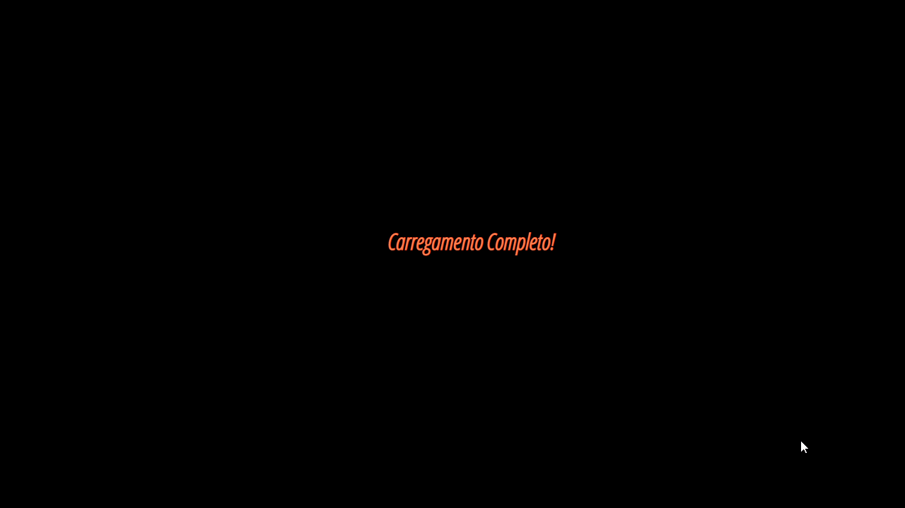

    

<h1 align="center">
    Promises
</h1>

This project aims to demonstrate the functioning of Promises on a web page

## 📌 Languages
In this project 3 types of languages ​​were used

- ✔️ JavaScript
- ✔️ HTML
- ✔️ CSS